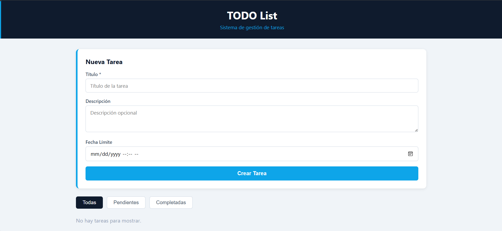
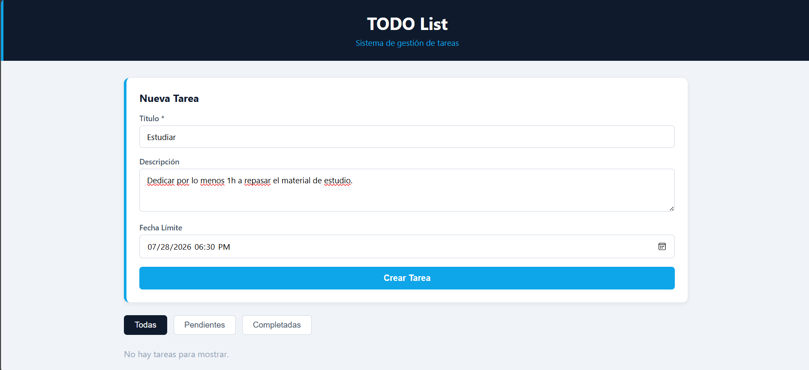
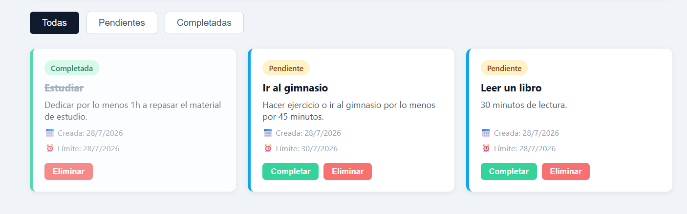

# TODO List — Sistema de Gestión de Tareas

Aplicación web simple para gestión de tareas personales, construida en .NET. Permite crear, completar, filtrar y eliminar tareas, con persistencia en archivo JSON local.

## Capturas

### Página de inicio


### Crear tarea


### Lista de tareas con filtros


## Tecnologías

- .NET 8
- C#
- Persistencia en archivo JSON (sin base de datos)

## Funcionalidades

- Crear tareas con título, descripción y fecha límite
- Marcar tareas como completadas
- Filtrar por estado (Todas / Pendientes / Completadas)
- Eliminar tareas

## Cómo correrlo localmente

```bash
cd "SIstema To Do List"
dotnet run
```

## Autor

Osmarlys David — [GitHub](https://github.com/OsmarFL)